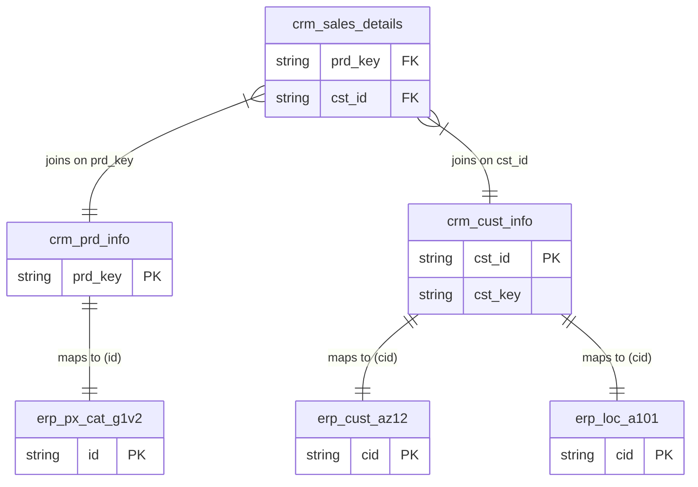

# Data Integration

> **Data Integration** is the process of combining data from multiple sources into a single, coherent dataset is called data integration.

### 1. Hierarchical Text Representation

**Customer Relationship Management (CRM)**

* **`crm_sales_details`** (SALES - Transactional Records about Sales & Orders)
* *Columns:* `prd_key`, `cst_id`
* *Relates to:* `crm_prd_info` (via `prd_key`) and `crm_cust_info` (via `cst_id`)

* **`crm_prd_info`** (PRODUCT - Current & History Product Information)
* *Columns:* `prd_key`
* *Integrates with ERP:* Links to `erp_px_cat_g1v2`

* **`crm_cust_info`** (CUSTOMER - Customer Information)
* *Columns:* `cst_id`, `cst_key`
* *Integrates with ERP:* Links to `erp_cust_az12` and `erp_loc_a101`

**Enterprise Resource Planning (ERP)**

* **`erp_px_cat_g1v2`** (PRODUCT - Product Categories)
* *Columns:* `id`

* **`erp_cust_az12`** (CUSTOMER - Extra Customer Information like Birthdate)
* *Columns:* `cid`

* **`erp_loc_a101`** (CUSTOMER - Location of Customers like Country)
* *Columns:* `cid`

---

---

### What This Implies 

This diagram illustrates **Data Integration**, which is the process of combining data from disparate sources into a single, unified view. Here is what this specific map tells us:

* **Breaking Down Data Silos:** An organization rarely has all its data in one place. Here, the CRM handles the "front office" (who bought what, transactional sales records), while the ERP handles the "back office" (product categories, deeper demographic data like birthdates and regional locations). To get a complete picture, the data must be stitched together.
* **Key Mapping is Required (Master Data Management):** Disparate systems rarely use the same naming conventions for IDs. The diagram implies a mapping exercise must occur:
* The CRM's product identifier (`prd_key`) must be matched to the ERP's product identifier (`id`).
* The CRM's customer identifier (`cst_key` or `cst_id`) must be matched to the ERP's customer identifier (`cid`).

* **Foundation for Dimensional Modeling:** This integration map is the exact logic required to build your Gold Layer.
* By joining `crm_cust_info` with `erp_cust_az12` and `erp_loc_a101`, data engineers can create a single, enriched **`dim_customers`** table.
* By joining `crm_prd_info` with `erp_px_cat_g1v2`, they can create a single, enriched **`dim_products`** table.

* **Data Enrichment:** A purely CRM-based sales report could only tell you *how much* a customer bought. By integrating the ERP data, a business analyst can now run a query to find out "Total sales by customer country" or "Sales of specific product categories segmented by customer age."
