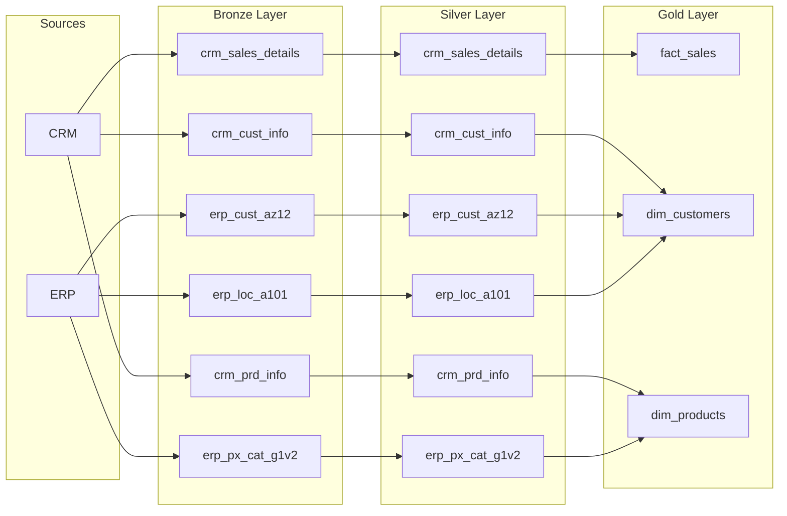

Here is the data flow and data lineage represented in Markdown.

### 1. Hierarchical Text Representation

**Sources**

* **CRM**
* ➔ `crm_sales_details` (Bronze)
* ➔ `crm_cust_info` (Bronze)
* ➔ `crm_prd_info` (Bronze)

* **ERP**
* ➔ `erp_cust_az12` (Bronze)
* ➔ `erp_loc_a101` (Bronze)
* ➔ `erp_px_cat_g1v2` (Bronze)

---

**Medallion Architecture Lineage**

* **Fact: Sales** (`fact_sales` - Gold)
* *Sourced from:* `crm_sales_details` (Silver) ➔ `crm_sales_details` (Bronze) ➔ CRM

* **Dimension: Customers** (`dim_customers` - Gold)
* *Sourced from:* `crm_cust_info` (Silver) ➔ `crm_cust_info` (Bronze) ➔ CRM
* *Sourced from:* `erp_cust_az12` (Silver) ➔ `erp_cust_az12` (Bronze) ➔ ERP
* *Sourced from:* `erp_loc_a101` (Silver) ➔ `erp_loc_a101` (Bronze) ➔ ERP

* **Dimension: Products** (`dim_products` - Gold)
* *Sourced from:* `crm_prd_info` (Silver) ➔ `crm_prd_info` (Bronze) ➔ CRM
* *Sourced from:* `erp_px_cat_g1v2` (Silver) ➔ `erp_px_cat_g1v2` (Bronze) ➔ ERP

---

### 2. Mermaid.js Flowchart

You can paste this code block into any Markdown viewer that supports Mermaid (like GitHub, Notion, or Obsidian) to automatically generate the visual diagram.

