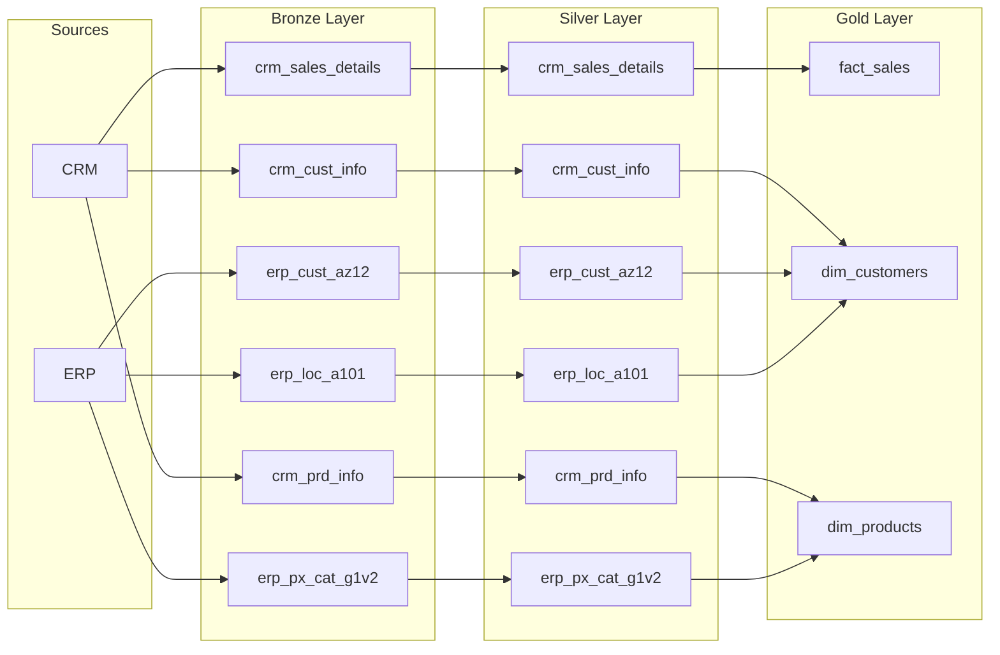

---
# Introduction to Data Lineage

> **Data lineage** is the comprehensive map of your data’s journey. It tracks the complete lifecycle of data: its origin, every transformation it undergoes, and its final destination.
---

## Why is Data Lineage Critical?

As data ecosystems grow from a few tables to thousands of interdependent models, tracking dependencies manually becomes impossible. Implementing clear data lineage serves four primary functions:

* **Root Cause Analysis (Debugging):** When a metric drops or a dashboard breaks, lineage prevents blind guessing. Engineers can trace a broken Gold-layer metric upstream through the Silver layer to find the exact source ingestion that failed.
* **Impact Analysis (Preventing Disasters):** Before altering or dropping a source column (e.g., changing `cust_id` to `customer_identifier`), lineage allows teams to look downstream. This reveals exactly which models and dashboards will be affected, enabling proactive updates before systems crash.
* **Trust and Data Quality:** Stakeholders rarely trust a number they don't understand. Lineage provides transparency, proving exactly which source systems, filters, and business logic fed into a final dashboard metric.
* **Regulatory Compliance and Auditing:** Under data privacy laws (like GDPR or HIPAA), organizations must track Personally Identifiable Information (PII). Lineage allows compliance teams to find exactly where a user's data has propagated throughout the warehouse so it can be properly audited or deleted.

---

