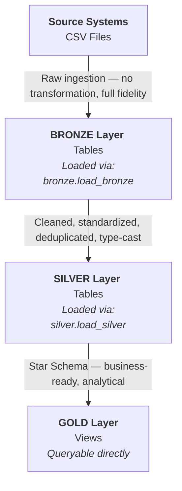
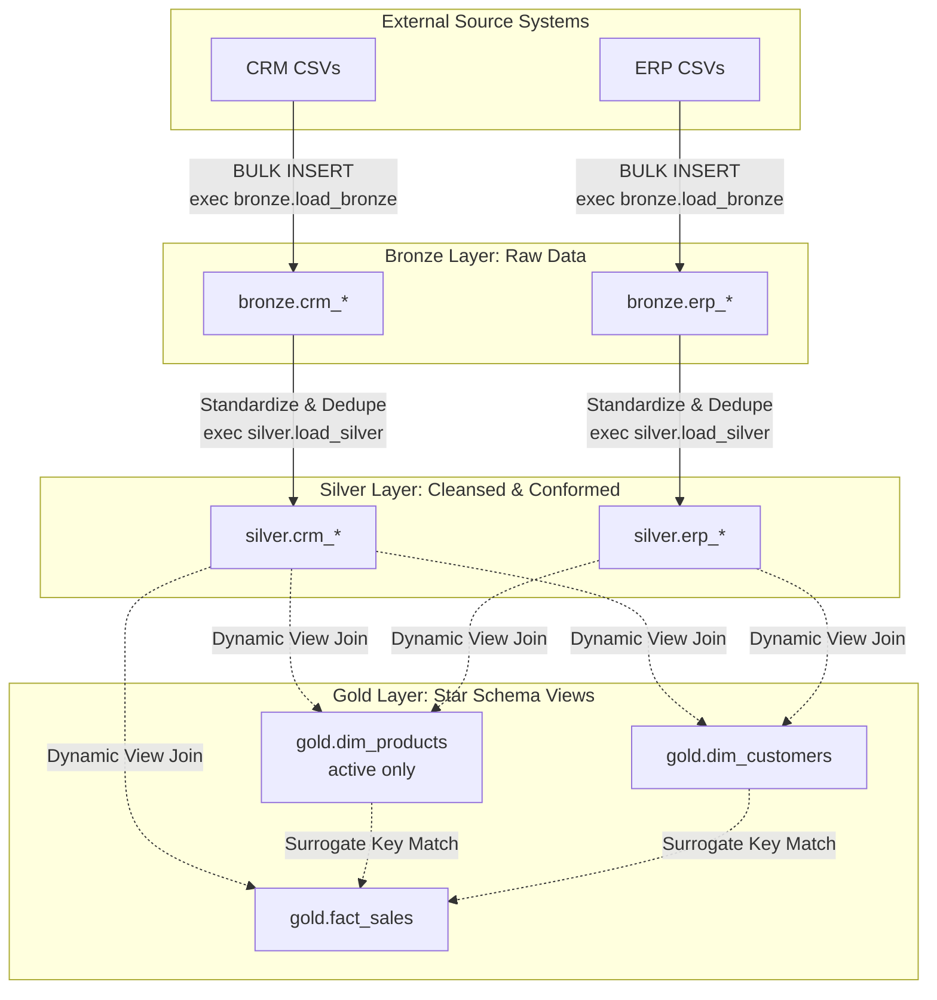
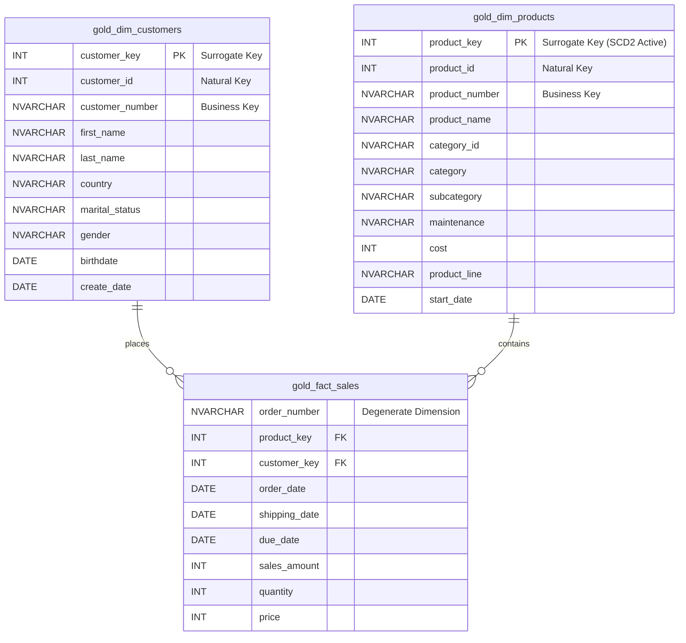

# Data Catalog — Gold Layer
### Data Warehouse | Star Schema | Business-Ready Analytics

---

## Why a Data Catalog?

In any multi-layer data warehouse architecture, raw data passes through several stages of transformation before it becomes consumable. By the time data reaches the **Gold layer**, it has been:

- Ingested from source systems (Bronze)
- Cleaned, deduped, standardized, and validated (Silver)
- Joined, enriched, and modeled into a **Star Schema** (Gold)

Without a catalog, the Gold layer is a black box. Analysts, BI developers, and data consumers are left guessing: *What does `customer_key` mean? Where does `gender` actually come from? Why is `prd_end_dt` sometimes NULL?* These questions cost time, introduce errors, and erode trust in data.

**A data catalog answers those questions definitively** — it documents not just what columns exist, but what they mean, where they came from, what transformations shaped them, and how they should be used.

---

## Why Document the Gold Layer Specifically?

The Gold layer is the **only layer** that business users, analysts, and BI tools directly query. Bronze is raw and unsafe to expose. Silver is clean but technical and normalized. Gold is the presentation layer — optimized for reporting and analytics via a Star Schema (fact + dimension tables).

Documenting Gold specifically matters because:

| Reason | Implication |
|--------|-------------|
| **It's the consumer-facing layer** | Every dashboard, report, or ad-hoc query starts here. Misunderstood columns lead to wrong insights. |
| **Surrogate keys replace natural keys** | `customer_key` and `product_key` are system-generated integers — they mean nothing without documentation. |
| **Business logic is baked in** | Gender resolution, cost fallback to 0, SCD Type 2 filtering — these are invisible without a catalog. |
| **Multi-source joins are hidden** | Gold views silently combine CRM and ERP data. A consumer has no way to trace lineage without this document. |
| **Views have no column-level metadata in SQL Server** | SSMS and most BI tools show column names but not meaning, origin, or transformation logic. |

In short: **the Gold layer is where SQL ends and storytelling begins.** This catalog is that story.

---

## Architecture Overview

---

**Gold layer objects are SQL Views** — they do not store data. They compute on-the-fly from Silver tables every time they are queried. This ensures Gold always reflects the latest Silver state without a separate ETL run.

---

## Gold Layer Objects

| Object | Type | Role in Star Schema | Row Grain |
|--------|------|---------------------|-----------|
| `gold.dim_customers` | View | Customer Dimension | One row per unique customer |
| `gold.dim_products` | View | Product Dimension | One row per currently active product version |
| `gold.fact_sales` | View | Central Fact Table | One row per sales order line |

---

## `gold.dim_customers`

### Purpose
The customer dimension consolidates identity, demographic, and location data from two source systems — the CRM (primary) and ERP (supplementary). It provides a single, clean, deduplicated record per customer for use in all sales analytics.

### Source Tables (Silver Layer)

| Silver Table | Contribution |
|---|---|
| `silver.crm_cust_info` | Primary source: identity fields, marital status, gender, create date |
| `silver.erp_cust_az12` | Supplementary: birthdate, fallback gender |
| `silver.erp_loc_a101` | Supplementary: country of residence |

### Column Reference

| Column Name | Data Type | Description | Source | Transformation Notes |
|---|---|---|---|---|
| `customer_key` | INT | **Surrogate key.** System-generated integer for joining to `fact_sales`. Has no meaning outside this warehouse. | Generated | `ROW_NUMBER() OVER (ORDER BY cst_id)` — deterministic order by CRM customer ID |
| `customer_id` | INT | **Natural key.** The original numeric ID from the CRM source system. | `crm_cust_info.cst_id` | No transformation. Used as the join key to `fact_sales` |
| `customer_number` | NVARCHAR(50) | **Business identifier.** A human-readable code used in both CRM and ERP to cross-reference a customer. | `crm_cust_info.cst_key` | No transformation. Used as the join key to ERP tables in Silver |
| `first_name` | NVARCHAR(50) | Customer's first name. | `crm_cust_info.cst_firstname` | Whitespace trimmed in Silver (`TRIM`) |
| `last_name` | NVARCHAR(50) | Customer's last name. | `crm_cust_info.cst_lastname` | Whitespace trimmed in Silver (`TRIM`) |
| `country` | NVARCHAR(50) | Country of residence. | `erp_loc_a101.cntry` | Standardized in Silver: `'DE'` → `'Germany'`, `'US'`/`'USA'` → `'United States'`. Blank/NULL → `'n/a'` |
| `marital_status` | NVARCHAR(50) | Marital status. | `crm_cust_info.cst_marital_status` | Decoded in Silver: `'S'` → `'Single'`, `'M'` → `'Married'`, unknown → `'n/a'` |
| `gender` | NVARCHAR(50) | Customer's gender. | `crm_cust_info.cst_gndr` (primary), `erp_cust_az12.gen` (fallback) | **Two-source resolution logic:** CRM is the trusted source. ERP gender is used only when CRM value is `'n/a'`. Final fallback is `'n/a'` if both are unresolved. Both sources were decoded to `'Male'`/`'Female'` in Silver |
| `birthdate` | DATE | Customer's date of birth. | `erp_cust_az12.bdate` | Future dates nullified in Silver (`bdate > GETDATE() → NULL`) |
| `create_date` | DATE | Date the customer record was first created in the CRM source system. | `crm_cust_info.cst_create_date` | No transformation. Reflects original CRM timestamp |

---

## `gold.dim_products`

### Purpose
The product dimension provides a clean, enriched view of currently active products, combining CRM product master data with ERP category and subcategory classifications. Historical/expired product versions are excluded.

### Source Tables (Silver Layer)

| Silver Table | Contribution |
|---|---|
| `silver.crm_prd_info` | Primary source: product attributes, cost, line, dates |
| `silver.erp_px_cat_g1v2` | Supplementary: category hierarchy (category, subcategory, maintenance) |

### Column Reference

| Column Name | Data Type | Description | Source | Transformation Notes |
|---|---|---|---|---|
| `product_key` | INT | **Surrogate key.** System-generated integer for joining to `fact_sales`. Has no meaning outside this warehouse. | Generated | `ROW_NUMBER() OVER (ORDER BY prd_start_dt, prd_key)` — ordered by activation date then product key |
| `product_id` | INT | **Natural key.** The original numeric ID from the CRM source system. | `crm_prd_info.prd_id` | No transformation |
| `product_number` | NVARCHAR(50) | **Business identifier.** A human-readable code used in CRM to identify products. Used to join sales transactions to this dimension. | `crm_prd_info.prd_key` | Extracted in Silver: characters 7 onward of the raw composite key (first 5 characters held the `cat_id`) |
| `product_name` | NVARCHAR(50) | Descriptive name of the product. | `crm_prd_info.prd_nm` | No transformation in Gold. Whitespace handled in Silver if applicable |
| `category_id` | NVARCHAR(50) | Derived category identifier extracted from the CRM product key. Used to join with ERP category reference data. | `crm_prd_info.cat_id` | Extracted in Silver: first 5 chars of raw `prd_key`, with `-` replaced by `_` |
| `category` | NVARCHAR(50) | Top-level product category (e.g., `Bikes`, `Accessories`). | `erp_px_cat_g1v2.cat` | Sourced from ERP reference data via `cat_id` → `id` join |
| `subcategory` | NVARCHAR(50) | Sub-category within the top-level category (e.g., `Road Bikes`, `Helmets`). | `erp_px_cat_g1v2.subcat` | Sourced from ERP reference data via `cat_id` → `id` join |
| `maintenance` | NVARCHAR(50) | Maintenance classification flag from the ERP product reference. | `erp_px_cat_g1v2.maintenance` | No transformation. Loaded as-is from ERP |
| `cost` | INT | Manufacturing or acquisition cost of the product. | `crm_prd_info.prd_cost` | NULL costs replaced with `0` in Silver (`ISNULL(prd_cost, 0)`) to prevent NULL propagation in margin calculations |
| `product_line` | NVARCHAR(50) | Standardized product line label. | `crm_prd_info.prd_line` | Decoded in Silver: `'M'` → `'Mountain'`, `'R'` → `'Road'`, `'S'` → `'Other Sales'`, `'T'` → `'Touring'`, unknown → `'n/a'` |
| `start_date` | DATE | The date from which this version of the product became active. | `crm_prd_info.prd_start_dt` | Cast from `DATETIME` to `DATE` in Silver. Time component was not meaningful |

---

## `gold.fact_sales`

### Purpose
The central fact table of the Star Schema. It records every sales order line transaction and links each to a product and a customer via surrogate keys. This is the primary table for sales volume, revenue, and pricing analytics.

### Source Tables

| Source | Contribution |
|---|---|
| `silver.crm_sales_details` | All transactional fields: order number, dates, sales amount, quantity, price |
| `gold.dim_products` | Resolves `sls_prd_key` (business key) → `product_key` (surrogate) |
| `gold.dim_customers` | Resolves `sls_cust_id` (natural key) → `customer_key` (surrogate) |

### Column Reference

| Column Name | Data Type | Description | Source | Transformation Notes |
|---|---|---|---|---|
| `order_number` | NVARCHAR(50) | **Degenerate dimension key.** The unique sales order identifier from the CRM source system. Not a surrogate — it carries meaningful information (order ID). | `crm_sales_details.sls_ord_num` | No transformation |
| `product_key` | INT | Foreign key to `gold.dim_products`. Identifies the product sold. | Resolved via `dim_products.product_key` | Joined on `sls_prd_key = dim_products.product_number` |
| `customer_key` | INT | Foreign key to `gold.dim_customers`. Identifies the purchasing customer. | Resolved via `dim_customers.customer_key` | Joined on `sls_cust_id = dim_customers.customer_id` |
| `order_date` | DATE | The date the sales order was placed. | `crm_sales_details.sls_order_dt` | Converted in Silver from raw `INT` (YYYYMMDD) to `DATE`. Invalid/zero values set to `NULL` |
| `shipping_date` | DATE | The date the order was shipped from the warehouse. | `crm_sales_details.sls_ship_dt` | Converted in Silver from raw `INT` (YYYYMMDD) to `DATE`. Invalid/zero values set to `NULL` |
| `due_date` | DATE | The expected delivery date for the order. | `crm_sales_details.sls_due_dt` | Converted in Silver from raw `INT` (YYYYMMDD) to `DATE`. Invalid/zero values set to `NULL` |
| `sales_amount` | INT | Total monetary value of the order line. | `crm_sales_details.sls_sales` | Recalculated in Silver when original is NULL, zero, negative, or inconsistent with `quantity × price`: `sls_quantity × ABS(sls_price)` |
| `quantity` | INT | Number of product units in the order line. | `crm_sales_details.sls_quantity` | No transformation in Gold. Used in Silver for `sales_amount` and `price` derivation |
| `price` | INT | Unit price of the product at the time of the order. | `crm_sales_details.sls_price` | Derived in Silver when NULL or invalid: `sls_sales / NULLIF(sls_quantity, 0)`. `NULLIF` prevents division-by-zero |

---
## Data Lineage

The data warehouse follows a batch-processed Medallion Architecture. Data flows from external CSV files through a series of SQL stored procedures and dynamic views.

---
## Star Schema Entity-Relationship Diagram (ERD)

**Fact Table Grain:** One row per individual sales order line item.

---

