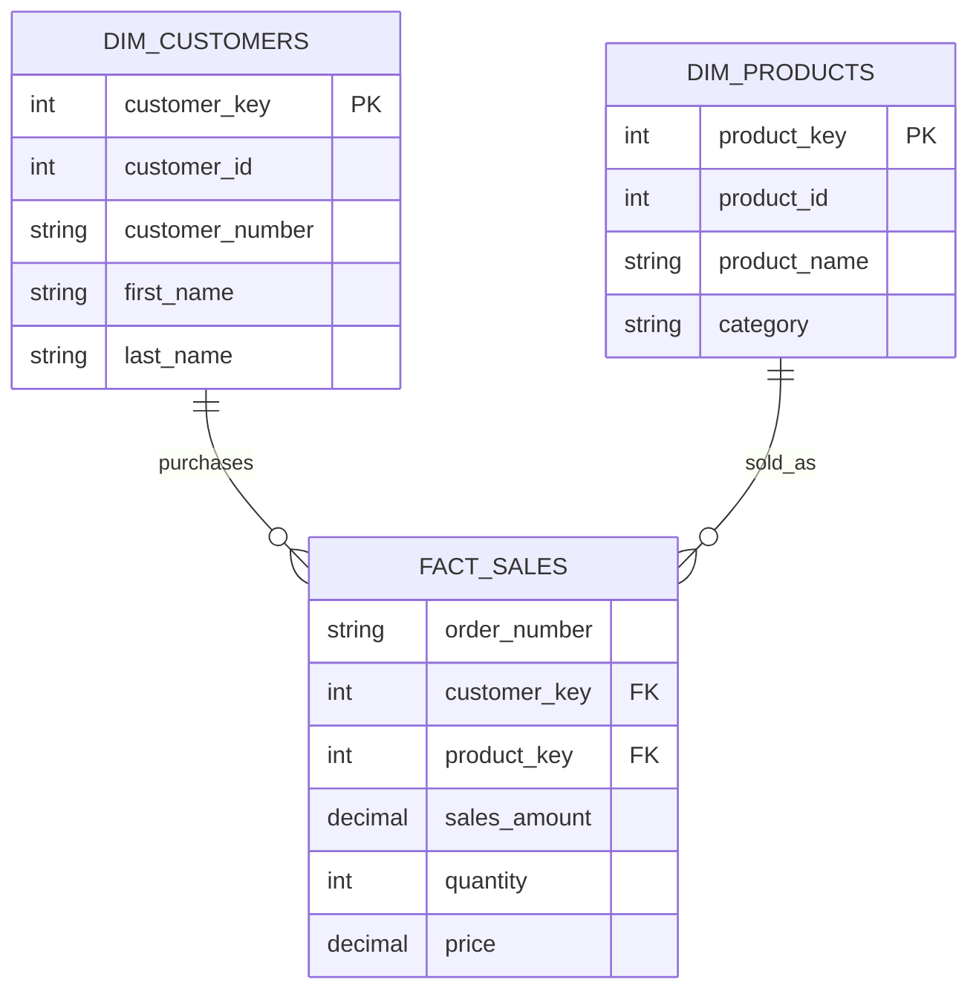

# 📚 Gold Layer Data Catalog

> Business-ready analytics layer built on a Star Schema model using SQL Server Views.

---

# Table of Contents

* [Overview](#overview)
* [Governance Metadata](#governance-metadata)
* [Why a Data Catalog?](#why-a-data-catalog)
* [Why Document the Gold Layer?](#why-document-the-gold-layer)
* [General Modeling Standards & Business Rules](#general-modeling-standards--business-rules)
* [Architecture Overview](#architecture-overview)
* [Gold Layer Objects](#gold-layer-objects)

  * [dim_customers](#golddim_customers)
  * [dim_products](#golddim_products)
  * [fact_sales](#goldfact_sales)
* [Data Lineage](#data-lineage)
* [Star Schema](#star-schema)

---

# Overview

The Gold Layer represents the final presentation layer of the Data Warehouse.

It exposes curated business entities through a Star Schema consisting of:

* Customer Dimension
* Product Dimension
* Sales Fact Table

All Gold objects are implemented as SQL Views and are derived directly from Silver Layer tables.

The purpose of the Gold Layer is to provide:

* Business-ready analytics
* Consistent reporting
* Simplified querying
* Trusted metrics
* Semantic business definitions

---

# Governance Metadata

| Attribute         | Value                              |
| ----------------- | ---------------------------------- |
| Domain            | Enterprise Sales & Analytics       |
| Architecture      | Medallion (Bronze → Silver → Gold) |
| Environment       | Production (`prod_dw.gold`)        |
| Data Steward      | Data Engineering Team              |
| Refresh Strategy  | Query-time computation             |
| Data Model        | Star Schema                        |
| Consumption Layer | BI & Analytics                     |

---

# Why a Data Catalog?

A Data Catalog serves as the business dictionary of the Data Warehouse.

As data flows through the Medallion Architecture:

```text
Sources
   │
   ▼
Bronze
   │
   ▼
Silver
   │
   ▼
Gold
```

it undergoes multiple transformations.

By the time data reaches the Gold Layer, it has been:

* Ingested from source systems
* Cleaned and validated
* Standardized
* Enriched
* Modeled into analytical structures

Without proper documentation, users may struggle to understand:

* Column meanings
* Data lineage
* Business logic
* Surrogate keys
* Data quality assumptions

This catalog provides a trusted reference for all consumers of the Gold Layer.

---

# Why Document the Gold Layer?

The Gold Layer is the primary interface between the Data Warehouse and business users.

| Reason                   | Business Impact                            |
| ------------------------ | ------------------------------------------ |
| Consumer-facing layer    | Every dashboard and report originates here |
| Surrogate keys           | Require documentation for interpretation   |
| Embedded business logic  | Must be transparent to consumers           |
| Multi-source integration | Lineage must remain visible                |
| Self-service analytics   | Improves trust and usability               |

> The Gold Layer is where raw data becomes business insight.

---

# General Modeling Standards & Business Rules

## Unknown Dimension Members

Records with missing dimension references receive:

```text
Surrogate Key = -1
```

Dimension tables contain corresponding records such as:

```text
Unknown
Not Applicable
Missing
```

---

## Currency Standardization

All monetary values are standardized to:

```text
USD
```

Applicable fields:

* sales_amount
* price
* cost

---

## Date Format

All date columns follow ISO-8601 format:

```text
YYYY-MM-DD
```

---

## Active Records

Gold dimensions expose only active records.

Current implementation follows:

```text
SCD Type 1 Presentation Layer
```

Historical tracking remains available within Silver tables.

---

# Architecture Overview

```text
CSV Source Files
       │
       ▼
┌─────────────┐
│   BRONZE    │
│ Raw Tables  │
└──────┬──────┘
       │
       ▼
┌─────────────┐
│   SILVER    │
│ Cleansed    │
│ Tables      │
└──────┬──────┘
       │
       ▼
┌─────────────┐
│    GOLD     │
│ SQL Views   │
└──────┬──────┘
       │
       ▼
 BI / Analytics
```

---

# Gold Layer Objects

| Object Name          | Type | Description        | Grain                        |
| -------------------- | ---- | ------------------ | ---------------------------- |
| `gold.dim_customers` | View | Customer Dimension | One row per customer         |
| `gold.dim_products`  | View | Product Dimension  | One row per active product   |
| `gold.fact_sales`    | View | Sales Fact Table   | One row per sales order line |

---

# gold.dim_customers

## Purpose

Provides a unified customer record by combining CRM and ERP customer data.

---

## Source Tables

| Table                  | Purpose                                |
| ---------------------- | -------------------------------------- |
| `silver.crm_cust_info` | Customer master data                   |
| `silver.erp_cust_az12` | Birthdate and supplementary attributes |
| `silver.erp_loc_a101`  | Geographic information                 |

---

## Columns

| Column          | Data Type    | Description                 |
| --------------- | ------------ | --------------------------- |
| customer_key    | INT          | Surrogate primary key       |
| customer_id     | INT          | CRM customer identifier     |
| customer_number | NVARCHAR(50) | Business customer code      |
| first_name      | NVARCHAR(50) | First name                  |
| last_name       | NVARCHAR(50) | Last name                   |
| country         | NVARCHAR(50) | Country of residence        |
| marital_status  | NVARCHAR(50) | Standardized marital status |
| gender          | NVARCHAR(50) | Standardized gender         |
| birthdate       | DATE         | Customer date of birth      |
| create_date     | DATE         | CRM creation date           |

---

## Data Quality Rules

* `customer_key` must be unique.
* `customer_key` cannot be NULL.
* Birthdate must be valid.
* Duplicate customers are removed.

---

# gold.dim_products

## Purpose

Provides enriched product information by combining CRM product data with ERP category hierarchies.

---

## Source Tables

| Table                    | Purpose             |
| ------------------------ | ------------------- |
| `silver.crm_prd_info`    | Product master data |
| `silver.erp_px_cat_g1v2` | Category hierarchy  |

---

## Columns

| Column         | Data Type     | Description                 |
| -------------- | ------------- | --------------------------- |
| product_key    | INT           | Surrogate primary key       |
| product_id     | INT           | CRM product identifier      |
| product_number | NVARCHAR(50)  | Business product code       |
| product_name   | NVARCHAR(50)  | Product name                |
| category_id    | NVARCHAR(50)  | Product category identifier |
| category       | NVARCHAR(50)  | Product category            |
| subcategory    | NVARCHAR(50)  | Product subcategory         |
| maintenance    | NVARCHAR(50)  | Maintenance flag            |
| cost           | DECIMAL(18,2) | Product cost                |
| product_line   | NVARCHAR(50)  | Product line                |
| start_date     | DATE          | Product activation date     |

---

## Data Quality Rules

* `product_key` must be unique.
* `product_key` cannot be NULL.
* Cost must be greater than or equal to zero.

---

# gold.fact_sales

## Purpose

Stores sales transaction data at the sales-order-line grain.

This table supports:

* Revenue analysis
* Product performance analysis
* Customer analytics
* Operational reporting

---

## Source Tables

| Table                      | Purpose            |
| -------------------------- | ------------------ |
| `silver.crm_sales_details` | Sales transactions |
| `gold.dim_products`        | Product lookup     |
| `gold.dim_customers`       | Customer lookup    |

---

## Columns

| Column        | Data Type     | Description            |
| ------------- | ------------- | ---------------------- |
| order_number  | NVARCHAR(50)  | Sales order identifier |
| product_key   | INT           | Product foreign key    |
| customer_key  | INT           | Customer foreign key   |
| order_date    | DATE          | Order date             |
| shipping_date | DATE          | Shipping date          |
| due_date      | DATE          | Due date               |
| sales_amount  | DECIMAL(18,2) | Total sales amount     |
| quantity      | INT           | Quantity sold          |
| price         | DECIMAL(18,2) | Unit price             |

---

## Data Quality Rules

* Composite grain:

  * order_number
  * product_key
  * customer_key
* Foreign keys never contain NULL values.
* Missing dimensions map to surrogate key `-1`.
* Sales amount must equal quantity × price.

---

# Data Lineage

```text
CRM Customer Data
        │
        ▼
silver.crm_cust_info
        │
        ▼
gold.dim_customers

ERP Customer Data
        │
        ▼
silver.erp_cust_az12
        │
        ▼
gold.dim_customers

ERP Location Data
        │
        ▼
silver.erp_loc_a101
        │
        ▼
gold.dim_customers


CRM Product Data
        │
        ▼
silver.crm_prd_info
        │
        ▼
gold.dim_products

ERP Category Data
        │
        ▼
silver.erp_px_cat_g1v2
        │
        ▼
gold.dim_products


CRM Sales Data
        │
        ▼
silver.crm_sales_details
        │
        ▼
gold.fact_sales
```

---

# Star Schema



---

# Summary

The Gold Layer provides a trusted, business-friendly analytical model built on top of cleansed Silver Layer data.

Key characteristics:

* Star Schema design
* Query-time computation through SQL Views
* Business-ready dimensions and facts
* Consistent governance standards
* Simplified consumption for BI and analytics tools
