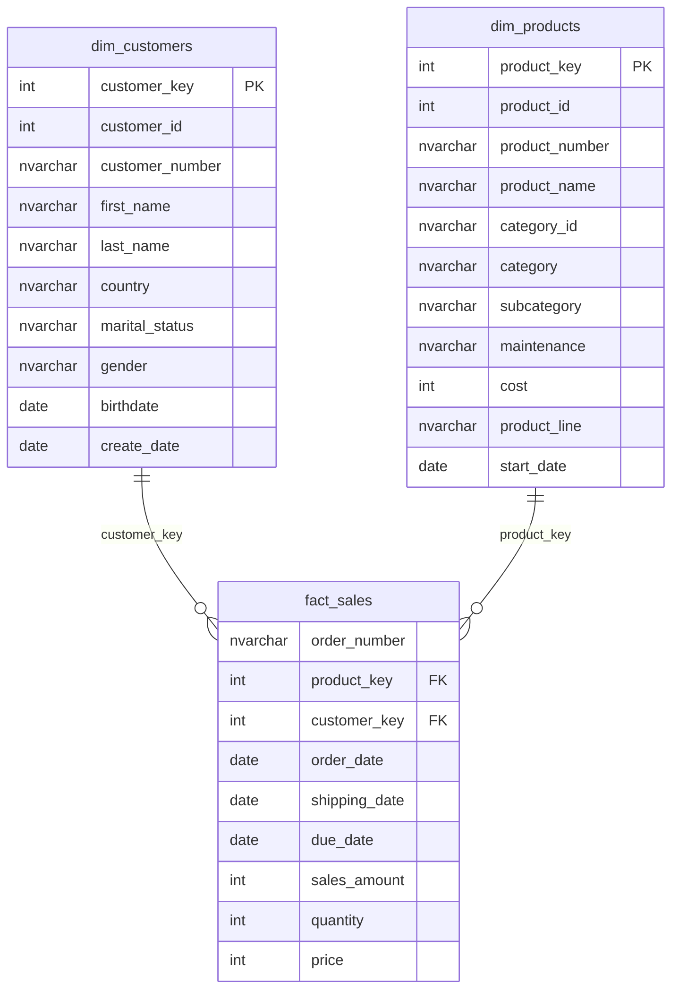

# Data Model — Star Schema (Gold Layer)
---

## Schema Overview

The Data Model is structured as a **star schema** — a single central fact table recording every sales transaction, surrounded by two conformed dimension tables that provide descriptive context for customers and products.

The fact table sits at the centre of the model; every analytical query joins outward to one or both dimensions to add meaning to the raw measures.

---

## Entity Relationship Diagram

---

## Relationships

| Relationship                              | Cardinality | Join Key        | Description                                                |
|-------------------------------------------|-------------|-----------------|-------------------------------------------------------------|
| `dim_customers` → `fact_sales`            | One-to-Many | `customer_key`  | One customer can place many orders across multiple periods  |
| `dim_products`  → `fact_sales`            | One-to-Many | `product_key`   | One product can appear across many order line items        |

> **Note:** Both joins use the **surrogate key** (system-generated `_key` columns). Never join on `customer_id` or `product_id` — these are source-system natural keys and may not be unique in the dimension tables when historical versions exist.

---

## Column Accepted Values

| Table              | Column           | Accepted Values              |
|--------------------|------------------|------------------------------|
| `dim_customers`    | `marital_status` | `'Married'`, `'Single'`      |
| `dim_customers`    | `gender`         | `'Male'`, `'Female'`, `'n/a'`|
| `dim_products`     | `maintenance`    | `'Yes'`, `'No'`              |

---

## Business Rules

| Rule                   | Definition                                                                                     |
|------------------------|-----------------------------------------------------------------------------------------------|
| **Sales Calculation**  | `sales_amount = quantity × price` — computed and stored at load time during Silver transformation |
| **Authoritative Revenue** | Always use the pre-computed `sales_amount` column as the revenue measure. Do not re-derive `price × quantity` in ad-hoc queries; rounding and discount adjustments applied at transformation time mean the stored value is the correct figure. |
| **Order Count**        | Use `COUNT(DISTINCT order_number)` to count orders. `COUNT(*)` returns line item count, not order count. |
| **Age Derivation**     | Customer age is not stored; always derive at query time using `DATEDIFF(YEAR, birthdate, GETDATE())`. Filter `WHERE birthdate IS NOT NULL` before computing. |
